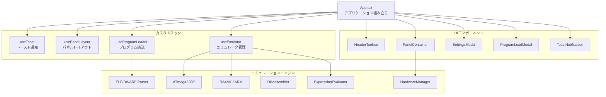

# Arduino Simulator

ブラウザ上でArduinoプログラム（HEX/ELF形式）を実行・デバッグできるシミュレータです。  
仮想的なハードウェアコンポーネント（LED、スイッチ、モーター、7セグメントディスプレイ等）をブレッドボード上に配置し、プログラムとの連携動作を視覚的に確認できます。

## 主な機能

- **プログラムの実行・デバッグ** — Intel HEX / ELF 形式のバイナリを読み込み、ステップ実行・一時停止・リセットが可能
- **対応アーキテクチャ** — AVR (ATmega328P) / ARM Cortex-M4 (RA4M1)
- **ブレークポイント** — アドレス指定・行指定に対応。条件式ブレークポイントもサポート
- **ウォッチ式** — 変数やレジスタの値をリアルタイムで監視（HEX/DEC/BIN 表示切替）
- **ソースコードビュー** — Cソースと逆アセンブリを切替表示。ソース内アセンブリ表示にも対応
- **CPUレジスタ表示** — 全レジスタ・SFR の値をリアルタイム表示
- **仮想ハードウェア** — LED、スイッチ、ポテンショメータ、モーター、7セグメントディスプレイ、LCD1602、オシロスコープ等
- **シリアルコンソール** — UART 出力の確認とシリアル入力の送信
- **パネルレイアウトのカスタマイズ** — ドラッグ&ドロップでパネルを自由に配置変更可能（カラム幅リサイズ対応）
- **サンプルプログラム** — 組み込みサンプル（Blink, ハイブリッドシステム等）をワンクリックで読み込み
- **フォルダ読み込み** — ローカルのArduinoプロジェクトフォルダ（.c, .h, .hex, .elf, .lss）を一括インポート
- **プロジェクト保存** — 現在の状態をJSONファイルとしてエクスポート

## セットアップ

### 必要環境

- Node.js 18+
- npm

### インストール

```bash
npm install
```

### 開発サーバーの起動

```bash
npm run dev
```

ブラウザで `http://localhost:5173` を開いてください。

### プロダクションビルド

```bash
npm run build
npm run preview
```

## 使い方

### 1. プログラムの読み込み

ヘッダーの **「📁 プログラム読込」** ボタンから以下の方法でプログラムを読み込めます。

#### サンプルから読み込み
プリセットのサンプルプログラム（Blink 等）をドロップダウンから選択してロードします。初回起動時は自動的にBlinkがロードされます。

#### フォルダから読み込み
ローカルのArduinoプロジェクトフォルダを選択すると、`.c`, `.h`, `.hex`, `.elf`, `.lss` ファイルを自動検出して読み込みます。ELFファイルが含まれている場合はDWARFデバッグ情報も自動解析されます。

#### プログラムのクリア
現在のプログラムとソースファイルをすべて破棄して初期状態に戻します。

### 2. 実行制御

ヘッダーのツールバーから操作します。

| ボタン | 操作 |
|---|---|
| ▶ / ⏸ | 実行 / 一時停止 |
| ⏭ | ステップ実行（1命令ずつ）|
| 🔄 | リセット |

### 3. デバッグ機能

#### ブレークポイント
ソースコードビュー上で行番号をクリックしてブレークポイントを設定・解除できます。条件式ブレークポイント（例: `r16 == 0x3F`）も設定可能です。

#### ウォッチ式
ウォッチパネルから変数やレジスタの式を追加して監視できます。表示形式はHEX / DEC / BIN から選択可能です。

### 4. ハードウェアシミュレーション

ブレッドボードパネルに表示されるハードウェアコンポーネントは設定ダイアログ（⚙️アイコン）から追加・設定できます。対応コンポーネント:

- **LED** — デジタルピンに接続
- **スイッチ** — デジタルピンへの入力（ON/OFF, PUSH）
- **ポテンショメータ** — アナログピンへの入力（0〜5V）
- **モーター** — PWM出力による回転表示
- **7セグメントディスプレイ** — 数値表示
- **LCD 1602** — 文字表示
- **オシロスコープ** — ピンの波形表示
- **ADキーボード** — アナログピンへのボタン入力

### 5. 設定

**「⚙️ 設定」** ボタンから以下の設定が可能です。

- **RESET EN 切断モード** — シリアル接続時のリセット動作を無効化
- **ハードウェア設定の初期化** — ブレッドボードのハードウェア構成をデフォルトに戻す
- **レイアウトの初期化** — パネルの配置をデフォルトに戻す

## アーキテクチャ

### 技術スタック

- **フレームワーク**: React 19 + TypeScript
- **ビルドツール**: Vite 7
- **AVRエミュレーション**: avr8js ライブラリをベースにカスタム実装

### ディレクトリ構成

```
src/
├── App.tsx                         # アプリケーションのルート（組み立て役）
├── main.tsx                        # エントリーポイント
├── index.css                       # グローバルスタイル
│
├── hooks/                          # カスタムフック
│   ├── useToast.ts                 # トースト通知の状態管理
│   ├── usePanelLayout.ts           # パネルレイアウト（DnD・リサイズ）
│   └── useProgramLoader.ts         # プログラム読込・パース・エクスポート
│
├── components/                     # UIコンポーネント
│   ├── HeaderToolbar.tsx            # ヘッダーツールバー（実行制御・ステータス）
│   ├── ToastNotification.tsx        # トースト通知表示
│   ├── SettingsModal.tsx            # 設定モーダル
│   ├── ProgramLoadModal.tsx         # プログラム読込モーダル
│   ├── PanelContainer.tsx           # 3カラムパネルレイアウト管理
│   ├── ViewPanel.tsx                # ソース/逆アセンブリビュー切替
│   ├── SourceViewer.tsx             # Cソースコードビュー
│   ├── DisassemblyPanel.tsx         # 逆アセンブリビュー
│   ├── HardwarePanel.tsx            # ブレッドボード（ハードウェアパネル）
│   ├── HardwareConfigDialog.tsx     # ハードウェア設定ダイアログ
│   ├── OscilloscopePanel.tsx        # オシロスコープパネル
│   ├── SerialConsole.tsx            # シリアルコンソール
│   ├── CpuStatePanel.tsx            # CPUレジスタ表示パネル
│   ├── BreakpointPanel.tsx          # ブレークポイント管理パネル
│   ├── WatchPanel.tsx               # ウォッチ式パネル
│   ├── Pin13Led.tsx                 # D13 LED インジケータ
│   └── RegisterDefinitions.ts       # レジスタ定義データ
│
├── emulator/                        # エミュレーションエンジン
│   ├── Emulator.ts                  # エミュレータ共通インターフェース
│   ├── useEmulator.ts               # エミュレータ管理フック
│   ├── atmega328p.ts                # AVR ATmega328P エミュレータ
│   ├── RA4M1.ts                     # ARM RA4M1 エミュレータ
│   ├── ARMCore.ts                   # ARM Cortex-M4 (Thumb-2) CPUコア
│   ├── intelhex.ts                  # Intel HEX パーサー
│   ├── ElfParser.ts                 # ELF バイナリパーサー
│   ├── DwarfParser.ts               # DWARF デバッグ情報パーサー
│   ├── Disassembler.ts              # AVR 逆アセンブラ
│   ├── SourceMapper.ts              # LSS↔ソースコード マッピング
│   ├── SourceFileManager.ts         # ソースファイル管理
│   ├── ExpressionEvaluator.ts       # 式評価エンジン（ウォッチ・条件式）
│   ├── PinMappings.ts               # Arduinoピン番号マッピング
│   ├── DebugTypes.ts                # デバッグ関連の型定義
│   │
│   └── hardware/                    # 仮想ハードウェアコンポーネント
│       ├── Component.ts             # コンポーネント共通インターフェース
│       ├── ComponentFactory.ts      # コンポーネントファクトリ
│       ├── HardwareManager.ts       # ハードウェア管理（ライフサイクル）
│       ├── HardwareConfig.ts        # ハードウェア構成の定義・永続化
│       ├── LedComponent.ts          # LED コンポーネント
│       ├── SwitchComponent.ts       # スイッチ コンポーネント
│       ├── PotentiometerComponent.ts # ポテンショメータ コンポーネント
│       ├── MotorComponent.ts        # モーター コンポーネント
│       ├── SevenSegmentComponent.ts  # 7セグメントディスプレイ
│       ├── Lcd1602Component.ts      # LCD 1602 コンポーネント
│       ├── OscilloscopeComponent.ts # オシロスコープ コンポーネント
│       └── AdKeyboardComponent.ts   # ADキーボード コンポーネント
│
public/
└── samples/                         # サンプルプログラム（JSON形式）
    └── sample_index.json            # サンプル一覧インデックス
```

### モジュール構成



### 設計方針

- **App.tsx は組み立て役** — ビジネスロジックを持たず、カスタムフックとコンポーネントを接続するだけの薄いシェル
- **カスタムフックで状態管理を分離** — プログラムロード、パネルレイアウト、トースト通知をそれぞれ独立したフックで管理
- **コンポーネントは表示に専念** — 各UIコンポーネントはprops経由でデータを受け取り、表示のみを担当
- **エミュレータはインターフェースで抽象化** — `Emulator` インターフェースにより AVR/ARM の差異を吸収

## ライセンス

MIT
